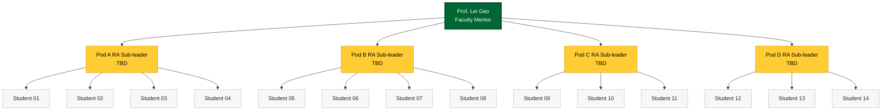

# Cohort

The ASSIP 2026 Empirical Finance Research Group is a single mentor group of **14 students** under Prof. Lei Gao. Fourteen is the high end of the typical ASSIP mentor-group size (ASSIP's published range is 2 – 15), so we operate with a **layered mentorship** structure: four PhD/RA sub-leaders run four pods of 3 – 4 students each, and Prof. Gao runs the full-cohort sessions and the weekly mentor session for each pod.

!!! note "Roster is filled in during Orientation"
    The 14 student profiles below are **placeholders**. Students fill in their own profile cards during the **June 18 orientation** (or by the end of **Week 1** at the latest). The pod assignments are made by Prof. Gao after the orientation interest survey.

---

## The 14 student profiles

-   :material-account-school: &nbsp; **Student 01**

    ---

    **School:** [TBD]
    **Year:** [HS/UG TBD]
    **Interests:** [TBD]
    **Project track:** [TBD]
    **Pod:** [A]

-   :material-account-school: &nbsp; **Student 02**

    ---

    **School:** [TBD]
    **Year:** [HS/UG TBD]
    **Interests:** [TBD]
    **Project track:** [TBD]
    **Pod:** [A]

-   :material-account-school: &nbsp; **Student 03**

    ---

    **School:** [TBD]
    **Year:** [HS/UG TBD]
    **Interests:** [TBD]
    **Project track:** [TBD]
    **Pod:** [A]

-   :material-account-school: &nbsp; **Student 04**

    ---

    **School:** [TBD]
    **Year:** [HS/UG TBD]
    **Interests:** [TBD]
    **Project track:** [TBD]
    **Pod:** [A]

-   :material-account-school: &nbsp; **Student 05**

    ---

    **School:** [TBD]
    **Year:** [HS/UG TBD]
    **Interests:** [TBD]
    **Project track:** [TBD]
    **Pod:** [B]

-   :material-account-school: &nbsp; **Student 06**

    ---

    **School:** [TBD]
    **Year:** [HS/UG TBD]
    **Interests:** [TBD]
    **Project track:** [TBD]
    **Pod:** [B]

-   :material-account-school: &nbsp; **Student 07**

    ---

    **School:** [TBD]
    **Year:** [HS/UG TBD]
    **Interests:** [TBD]
    **Project track:** [TBD]
    **Pod:** [B]

-   :material-account-school: &nbsp; **Student 08**

    ---

    **School:** [TBD]
    **Year:** [HS/UG TBD]
    **Interests:** [TBD]
    **Project track:** [TBD]
    **Pod:** [B]

-   :material-account-school: &nbsp; **Student 09**

    ---

    **School:** [TBD]
    **Year:** [HS/UG TBD]
    **Interests:** [TBD]
    **Project track:** [TBD]
    **Pod:** [C]

-   :material-account-school: &nbsp; **Student 10**

    ---

    **School:** [TBD]
    **Year:** [HS/UG TBD]
    **Interests:** [TBD]
    **Project track:** [TBD]
    **Pod:** [C]

-   :material-account-school: &nbsp; **Student 11**

    ---

    **School:** [TBD]
    **Year:** [HS/UG TBD]
    **Interests:** [TBD]
    **Project track:** [TBD]
    **Pod:** [C]

-   :material-account-school: &nbsp; **Student 12**

    ---

    **School:** [TBD]
    **Year:** [HS/UG TBD]
    **Interests:** [TBD]
    **Project track:** [TBD]
    **Pod:** [D]

-   :material-account-school: &nbsp; **Student 13**

    ---

    **School:** [TBD]
    **Year:** [HS/UG TBD]
    **Interests:** [TBD]
    **Project track:** [TBD]
    **Pod:** [D]

-   :material-account-school: &nbsp; **Student 14**

    ---

    **School:** [TBD]
    **Year:** [HS/UG TBD]
    **Interests:** [TBD]
    **Project track:** [TBD]
    **Pod:** [D]

---

## Layered mentorship

**How the layers work in practice.**

- **Daily** — pod stand-up on Slack at **9:30 am ET**, 15 minutes, RA sub-leader runs it.
- **Weekly** — pod working session with the RA sub-leader (Tue/Thu, 2 hours). Prof. Gao joins one pod each week on a rotation.
- **Weekly** — full-cohort mentor session with Prof. Gao, Wed 2:00 – 3:30 pm ET (see the [weekly schedule](../weekly/index.md)).
- **Ad hoc** — students can request a 1-on-1 with their RA sub-leader at any time; Prof. Gao 1-on-1s are by appointment (book via Slack).

Read the full mentor profiles on the [Mentors page](mentors.md).

---

## Cohort culture

!!! quote "Be kind to the person. Be tough on the work."
    The single sentence that governs how we critique each other in this cohort. You can — and should — say *that figure is unreadable* or *that robustness check is missing*. You may not say *you are sloppy*. The distinction matters because the same student will be defending the same poster on August 12; we want them to walk in confident, not wounded.

A few specifics:

- **Show up.** Remote is not a permission slip for invisibility. Camera on for mentor sessions, present in the Slack channel during work hours, commits on your branch by 5:00 pm ET.
- **Ask early.** A two-day rabbit hole on a bug that an RA could have unstuck in fifteen minutes is the most expensive thing you can do this summer. Slack first; Stack Overflow second; AI third — and always cite, per Chapter 6.5.
- **No fabrication, ever.** This is not optional and not negotiable. See the [Code of Conduct](code-of-conduct.md).
- **Reproduce before you trust.** Before you celebrate a number, re-run the pipeline from scratch and check that the same number falls out. Reproducibility is a habit, not an audit.
- **Credit the person who unblocked you.** In commits, in poster acknowledgments, in JSSR abstracts. The professional norm is generous credit; you start practicing it in Week 1.

---

## Communication channels

| Channel | Purpose | Norms |
|---------|---------|-------|
| **Slack workspace** *(`assip-2026-finance`, invites issued at orientation)* | Default for everything: questions, stand-ups, pings, share-outs. | Use threads. Cross-link to GitHub PRs. Async-first; do not expect replies outside 9 am – 6 pm ET. |
| **Zoom** | Full-cohort mentor sessions, pod working sessions, 1-on-1s. Links pinned in Slack `#announcements`. | Camera on for mentor sessions. Record only with consent of everyone on the call. |
| **GitHub** *(org: `gmu-assip-2026`, TBD)* | Code, PAPs, posters, all artifacts. | One repo per student. PR-based workflow; nothing pushed directly to `main`. |
| **Email** | Institutional / formal communication only — credit transcripts, JSSR submissions, family-facing announcements. | Cc Prof. Gao (<lgao9@gmu.edu>) and the program office (<cosassip@gmu.edu>) for anything official. |
| **Office hours** | Open Zoom room, **Friday 1:00 – 2:30 pm ET**, drop in. Pod sub-leaders also hold individual office hours; see the [Mentors page](mentors.md). | First-come, first-served. Bring code or a question, not just a feeling. |

The single canonical place for *the schedule this week* is the [weekly schedule](../weekly/index.md) and the "Right now" admonition on the [home page](../index.md). If anything anywhere on the wiki disagrees with that admonition, the admonition wins.
